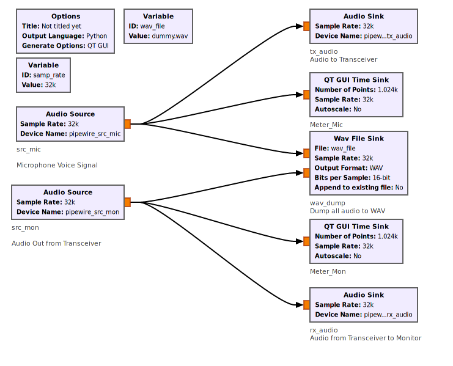

# GnuRadio Audio Patch Panel

Use Gnu Radio audio sinks to create audio pass-through and monitoring

## How to run

1. Install Gnu Radio and Gnu Radio Companion
2. Install pipewire
3. Copy `50-pipewire-aliases.conf` to `/etc/alsa/conf.d/50-pipewire-aliases.conf`
4. Run audiomix.py or open audiomix.grc in Gnu Radio Companion and run
5. Use pavucontrol to assign the right devices

## How to run without pipewire (i.e. with stock pulseaudio)

Skip step 3, but change all the audio devices from `pipewire_xxx` to `default`
